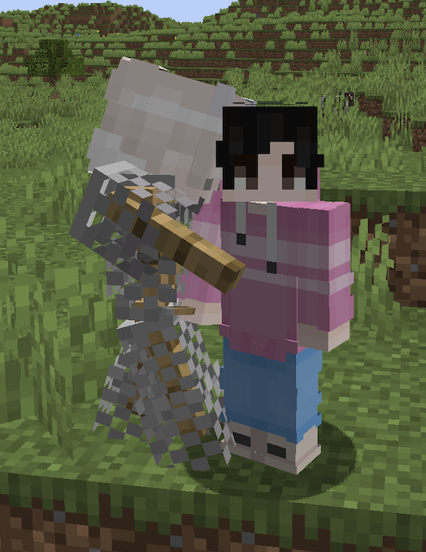

# ArmorStand Animations

This plugin moves armorstands in animations
You can change the positions of the animation by changeing the Animation class.
The positions of the armor stands are dependant on the quaterneon system that minecraft uses

# [Installation](https://docs.papermc.io/velocity/dev/creating-your-first-plugin)

Setting up your project
First, you will need to create a new project in your IDE. In Eclipse, you can do this by going to File > New > Java Project. In IntelliJ IDEA, you can go to File > New > Project.
Next, you will need to add the Spigot API (Application Programming Interface) as a dependency to your project. The Spigot API is a set of Java libraries that provide access to the internals of the Spigot server and allow you to create plugins. You can download the latest version of the Spigot API from the Spigot website: https://www.spigotmc.org/wiki/buildtools/. Once you have downloaded the API, you will need to add it to your project’s build path. In Eclipse, you can do this by right-clicking on your project in the Package Explorer and selecting “Build Path > Add External Archives”. In IntelliJ IDEA, you can go to File > Project Structure > Libraries and click the “+” button to add the API as a library.
You will also need to create a plugin.yml file, which is a configuration file that tells Spigot how to load and manage your plugin. This file should be placed in the root directory of your project. You can find more information about the plugin.yml file and the different options available here: https://www.spigotmc.org/wiki/creating-a-plugin-yml-file/.
Writing your Plugin

You will need to test it to make sure it is working as expected. You can do this by downloading your plugin’s jar file (which you can build by right-clicking on your project in the IDE and selecting “Export > JAR file”). This file can then be uploaded to your Pockethost Minecraft server.. Then, start the server and check the console for any errors or messages. If your plugin is working correctly, you should see a message saying that it has been enabled.
If your plugin is working as expected, you can share it with other players by uploading it to a website like SpigotMC or BukkitDev. Players can then download and install your plugin on their own servers.
